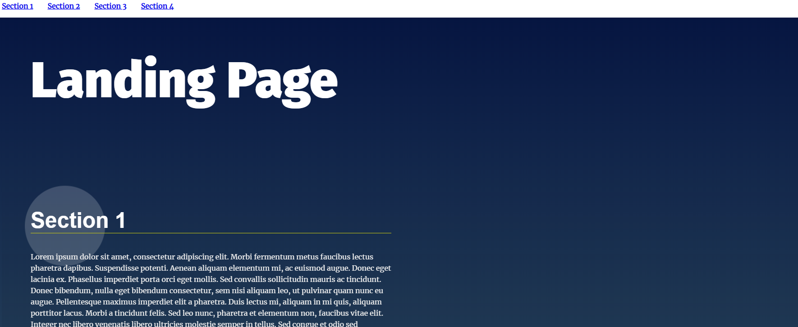

# Landing Page Project

This is Project 2 for Udacity's Front-End Nanodegree program. The Navigation Bar is created dynamically and an effect is added on the article that is currently on viewport.

## Table of Contents

1. index.html (provided by Udacity as starter code)
2. style.css (provided by Udacity as starter code)
3. app.js

## Instructions

Just download the files and open index.html on any browser. All the magic happens inside app.js, if you want to check the code be sure to do so with an editor.

## Homepage 

## Authors

Alex Karvounis - [al3xkarv](https://github.com/al3xkarv)

## License

This project is licensed under the GNU General Public License v3.0

